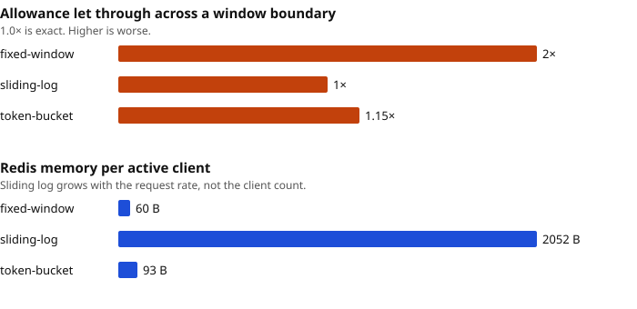

# Benchmark results

Generated by `npm run bench:accuracy && npm run bench:render`. Do not edit by
hand.

- Run at 2026-09-06 21:51:35 UTC on Darwin arm64, 8 cores, Node v23.4.0, Redis 8.10.1.
- Limit 100 per 2000 ms; 50 clients × 40 requests for the cost run.
- Method and what these numbers do **not** claim: [METHODOLOGY.md](../../bench/METHODOLOGY.md).

## Accuracy at a window boundary

The whole allowance is spent in the last moment of one window and again in the
first moment of the next. A true sliding window allows `limit` across that
span; anything more is allowance the client should not have had.

| strategy | allowed across the boundary | ideal | overshoot |
| --- | ---: | ---: | ---: |
| `fixed-window` | 200 | 100 | **2.00×** |
| `sliding-log` | 100 | 100 | **1.00×** |
| `token-bucket` | 115 | 100 | **1.15×** |

`fixed-window` let through 2.00× the limit. That is not a bug to tune away —
it is what a clock-aligned window means, and the only fix is a different
algorithm.

## Cost per decision

| strategy | Redis commands | memory per client | p50 | p99 |
| --- | ---: | ---: | ---: | ---: |
| `fixed-window` | 5 | 60 B | 0.43 ms | 1.656 ms |
| `sliding-log` | 7 | 2052 B | 0.424 ms | 1.099 ms |
| `token-bucket` | 5 | 93 B | 0.519 ms | 1.105 ms |

The command counts include the calls each Lua script makes internally, which is
why a one-round-trip decision still costs five or more: the script itself,
`TIME`, and the reads and writes it performs.

`sliding-log` uses 34× the memory of `fixed-window` per client, and that ratio
grows with the limit rather than staying fixed: it keeps one sorted-set member
per accepted request, so a limit of 1,000 per minute is 1,000 members per
active client.

Latency is measured against a Redis on the same machine and is a floor, not a
production figure. The comparison between strategies is the part that carries
over; the absolute numbers do not.
